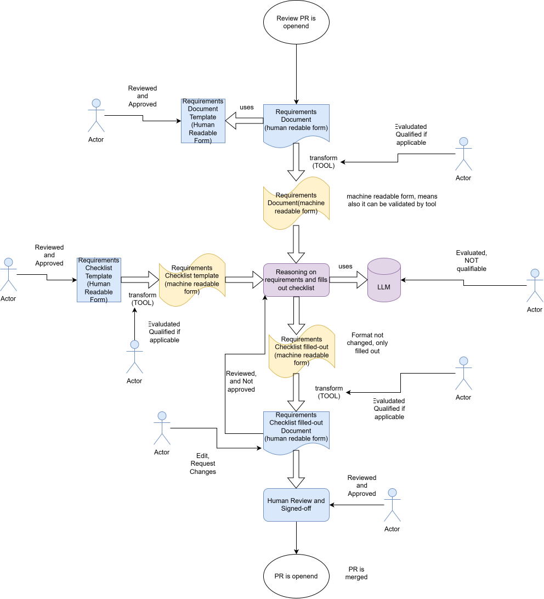

# AI-supported development process execution in a safety context

> **Context:** This document accompanies the discussion in
> [eclipse-score/process_description #805](https://github.com/eclipse-score/process_description/issues/805)
> — *"Pilot for AI supported development process execution in safe context"*.
> It describes a proposed concept and a pilot implementation.

---

## 1. The problem

The [S-CORE process description](https://eclipse-score.github.io/process_description/main/)
defines structured workflows, templates, and checklists to produce verifiable
safety evidence. Requirements inspection applies a level-appropriate checklist
to stakeholder, feature, and component requirements before they are accepted as
safety evidence. The checklist profile is not identical at every level.

Filling that checklist is **manual, time-consuming, and repetitive** — the
same quality questions apply to every requirement. Meanwhile, Large Language
Models (LLMs) are now capable of performing exactly this kind of structured
text assessment. The question is now
**under what conditions their output can legitimately enter a safety case**.

**The goal is development support**: AI assists an engineer during development.

So AI is only considered here as a **development support tool** —
it shall never generate safety evidence autonomously.

The safety premise is therefore:

> *If every AI-generated output is treated as a draft that a qualified engineer
> must explicitly review and approve before it becomes part of the safety case,
> then errors introduced by the AI can be detected and corrected before they
> cause any harm.*

This is not a novel concept. [ISO 26262 Part 8, Clause 11](https://www.iso.org/standard/68388.html)
establishes the principle of **tool confidence**: when a development tool
affects a safety-relevant work product, the confidence in that tool (and the
controls around it) must be demonstrated.

---

## 2. Concept: AI as a qualified development support tool

Based on ISO 26262 Part 8 tool confidence principles, the approach in this
pilot rests on three pillars:

### 2.1 The human review guardrail

The chat-first demonstration follows this sequence:

```
1. Engineer starts the inspection in Copilot Chat
      │
      ▼
2. Agent prepares permitted input and a structured draft assessment
      │
      ▼
3. Validated editable checklist (inspection.md) is presented
   Agent stops; engineer may edit or request corrections
      │
      ▼
4. Engineer copies the checked checklist into the project's real
   requirements inspection document and commits it
      │
      ▼
5. The normal Git/GitHub review of that change is the approval
```

This means the AI output is never in the safety case — only the
**human-reviewed and approved** version is. There is no local "approve"
command: this tool cannot fabricate, relay, or otherwise stand in for that
review. Approval is whatever the project's existing PR review already is —
authenticated by the platform, structurally unable to be the same person as
the content's author, and retained in the project's own version history.

The diagram below illustrates the same guardrail as a data-flow: every
human-readable/machine-readable conversion is performed by a deterministic
transform tool, never by the LLM, and a human explicitly reviews and approves
both the templates that feed the process and every artifact it produces.



The requirements document and checklist templates themselves are ordinary
repository content (the `feat_req`/`comp_req` directive schema and
`workflows/req_safety_inspection/prompts/inspection.md`).
They are reviewed and approved the same way as any other change, through
normal repository pull-request review — this satisfies the diagram's
"Template (Reviewed & Approved)" gates without a separate runtime step.

### 2.2 Fixed output schema (no invented structure)

The AI fills the exact public checklist, parsed directly from the canonical
[feature inspection checklist template](https://eclipse-score.github.io/process_description/main/folder_templates/platform/features/feature_name/requirements/req_inspection.html)
rather than a paraphrased or hand-copied summary — the same Review ID,
Acceptance Criteria, and Guidance columns, so there is no separate copy that
can silently drift from the template:

- `passed` per checklist item: `yes` / `no` / `n/a` / `not_assessed`.
  `not_assessed` means the AI lacked sufficient context (for example, a
  requirement's parent text was not supplied); it is never conflated with a
  genuine `n/a` or treated as a pass.
- Full remarks per item.
- A mandatory issue link whenever an item is `no`, matching the template's own
  mandatory "Issue link" column; forbidden for every other verdict.

The AI cannot add new sections, invent checklist IDs, or change the document
structure. Schema validation rejects any response that does not conform.

### 2.3 Model provenance and evaluation trigger

Available tool and model information is recorded with its source. Unavailable
active model details remain unknown. A change to model, prompt, configuration,
or intended use triggers evaluation of its impact on existing tool evidence.

Every AI assessment is a draft. A competent human independently reviews all
checklist entries, corrects errors, and explicitly approves the reviewed
artifact. This control can support error detection; it does not prove that all
errors are detected, that the reviewer is competent, or that the tool is qualified.

Tool qualification may also be required, based on the S-CORE tool evaluation
described in the [Tool Management process](https://eclipse-score.github.io/process_description/main/process_areas/tool_management/index.html),
if independent human review is not sufficient to establish error detection.

The pilot distinguishes two different kinds of tool confidence subjects. The
deterministic transform tools — the RST requirement parser, JSON schema
validator, and Markdown renderer in `workflows/` — perform a fixed,
independently testable conversion and can be evaluated and, if applicable,
qualified like any other development tool. The LLM reasoning step is treated
as categorically **not qualifiable** in this pilot: its output is never
evaluated for qualification credit and is always subject to the mandatory
human review and approval guardrail described above.

---

## 3. The executable concept

### 3.1 What the pilot implements

An automated workflow that pre-fills the feature/component S-CORE requirements
inspection checklist for each supported requirement in scope. The
[S-CORE process description](https://eclipse-score.github.io/process_description/main/requirements_engineering/index.html)
defines inspection for stakeholder, feature, and component requirement levels;
each level has applicable, potentially different inspection guidance.

The AI inspects each requirement against the quality criteria defined in the
S-CORE checklist — the same criteria a human reviewer would apply — and
provides a structured first-pass assessment with a verdict and rationale for
each criterion.

The pilot demonstrates an optional Copilot Chat Agent workflow for feature and
component requirements only. Stakeholder requirements remain part of the
existing S-CORE process and may be relevant as parent context, but are not
directly assessed by this demonstrator. Their dedicated checklist profile is
not implemented. Assumptions of use are also out of scope.

The Chat Agent workflow is:

```text
Engineer starts the inspection directly in Chat
  -> agent prepares input and automatically collects tool metadata
    -> Copilot Chat Agent produces a JSON assessment
    -> deterministic validation rejects wrong IDs, structure, or checklist drift
    -> editable inspection.md checklist is written and the agent stops
    -> engineer edits or requests corrections; re-validated on every check
    -> engineer copies the checklist into the project's real inspection
       document, commits it, and opens it for the normal Git/GitHub review
```

### 3.2 Fixed structure

Assessments contain one entry per input requirement, the exact public S-CORE
checklist IDs parsed from the canonical template, `yes` / `no` / `n/a` /
`not_assessed` verdicts, full remarks, and a mandatory issue link for every
`no`. Unknown IDs, duplicate JSON keys, additional fields, invalid verdicts,
missing requirements, or checklist text diverging from the canonical template
are rejected.

There is one editable checklist in
[`example/inspection.md`](https://github.com/eclipse-score/process_description/blob/main/process_extensions/example/inspection.md),
not a duplicate schema invented on top of it. The original judgment remains
preserved separately in a local manifest. Missing context must be resolved or
dispositioned by the reviewer; `not_assessed` must not silently become a pass.

### 3.3 Hand-off to the project's own review

After judgment the agent presents the editable checklist and ends its turn.
The engineer edits the table in [`example/inspection.md`](https://github.com/eclipse-score/process_description/blob/main/process_extensions/example/inspection.md)
or requests corrections in Chat. Every edit is re-validated and reported back
immediately; there is no local approval state to track, so no edit can be
mistaken for one.

There is no `Approve as <name>` command, no revision token, no audit.json, and
no report.rst produced by this tool. Finalization is the engineer copying the
checked checklist into the project's actual inspection work product (for
example ``doc__<feature>_req_inspection``), committing it, and relying on the
normal Git/GitHub review of that change — with its existing identity,
independence, and retention guarantees — as the only approval.

### Copilot provenance

Helpers automatically collect tool versions, workflow version and
code hashes, available editor metadata, and installed Copilot Chat versions.
Every value has a source. The active Copilot model cannot be auto-detected;
an engineer may optionally declare a model label explicitly, recorded with
its source as "reviewer supplied" rather than inferred or defaulted.

## 4. Requirements inspection demonstration

The included example used is a snapshot of four publicly available S-CORE baselibs
feature requirements. For example, the Utils Library requirement lists Base64,
scoped operations, string views, safe arithmetic, atomic operations, and
termination handling. This input demonstrates parsing and review flow; it is
not a set of independently validated expected verdicts.

The prompt summarizes the public S-CORE inspection checklist. It requests
structured draft assessments. Reviewers must
consider parent requirements, traceability, timing, interfaces, safety/security
attributes, verifiability, completeness, and justified exceptions.

Start in Chat using the reusable workflow prompt. The agent prepares input,
validates its JSON judgment, presents the checklist file, and stops. Check
permission to share input before starting. Local helpers collect metadata and
validate the checklist; they never invoke Copilot, transmit data, or approve
anything. Finalization happens outside this tool, through the project's own
requirements-inspection PR review.

The execution guide gives the Chat requests. Offline tests use constructed
responses, without invoking Copilot. No live Copilot result or timing measurement
is claimed by those tests. The historical pilot's assessments are not reported
as results from this implementation.

## 5. Additive S-CORE integration

All extension content is under `process_extensions/`. Existing process
directories and workflows remain in place. An additive Bazel bundle mount
publishes the concept, execution guide, and draft workflow definitions alongside
the existing process using `bazel run //:docs`.

The existing `wf__monitor_verify_requirements` accepts stakeholder, feature, and
component requirements, including `wp__requirements_stkh`. The optional
`wf__ai_req_safety_inspect` proposal augments it for feature/component
assessments only, with the same responsible/approving roles (committer,
supported by the safety manager as moderator) rather than a separate role set;
it references `wp__requirements_feat`, `wp__requirements_comp`, and
`wp__requirements_inspect`. Stakeholder requirements remain upstream context in
the existing workflow, not direct input to this AI profile. The S-CORE
stakeholder checklist differs and is not implemented here. Tool evaluation runs
through the existing `wf__tool_evaluate_tool`, `wf__tool_qualify_tool`, and
`wf__tool_approve_tool_verification_report` — this proposal supplements their
evidence with AI-specific guidance rather than adding parallel workflows or
roles for the same work product. Published nodes remain draft proposals, not
approved process changes. Runtime templates, inputs, tests, and generated
outputs are not published as process definitions.

## 6. Limitations

- The RST reader accepts simple feature/component requirement directives only.
  It rejects stakeholder/AOU and mixed-level files rather than applying the
  wrong checklist, and does not implement general Sphinx-Needs parsing.
- Parent IDs may be supplied, and an engineer may optionally supply parent or
  related requirement text as explicit context; without it, the linkage and
  completeness items are forced to `not_assessed` rather than guessed. Nothing
  retrieves that text automatically from `needs.json` or another repository yet.
- Copilot outputs are non-deterministic and require strict validation and human
  review. No ASIL coverage or completed qualification is claimed.
- Installed versions are not active-session metadata; selected or Auto-resolved
  model information remains unavailable without a supported editor integration.
  An engineer may declare a model label explicitly; nothing infers it.
- There is no automated comparison against already-inspected reference
  requirements to measure AI verdict accuracy; this would need an agreed
  evaluation set and acceptance criteria before use beyond a pilot.
- The tool's behavior (validation rules, the no-local-approval boundary,
  rejection of stakeholder/AoU input) is not yet expressed as tool requirements
  linked to the test suite that verifies it; the tests currently verify
  behavior that is not separately specified as a requirement.
- The guardrail no longer has a fabricate-able local approval step, but it
  still cannot prevent a privileged agent from bypassing the local scripts
  entirely or editing files outside the documented protocol.
- Published RST nodes express intended responsibilities; executable review
  controls do not replace project governance.

## 7. Public references

| Reference | URL |
|---|---|
| S-CORE project | https://eclipse-score.github.io/score/main/ |
| S-CORE process description | https://eclipse-score.github.io/process_description/main/ |
| Requirements Engineering | https://eclipse-score.github.io/process_description/main/process_areas/requirements_engineering/index.html |
| Feature inspection checklist | https://eclipse-score.github.io/process_description/main/folder_templates/platform/features/feature_name/requirements/req_inspection.html |
| Public baselibs requirements | https://eclipse-score.github.io/score/main/features/baselibs/requirements/index.html |
| Tool Management process | https://eclipse-score.github.io/process_description/main/process_areas/tool_management/index.html |
| Tool Management Plan | https://eclipse-score.github.io/score/main/platform_management_plan/tool_management.html |
| GitHub issue #805 | https://github.com/eclipse-score/process_description/issues/805 |
| ISO 26262 public catalogue entry | https://www.iso.org/standard/68388.html |
| Copilot in VS Code documentation | https://code.visualstudio.com/docs/copilot/overview |
